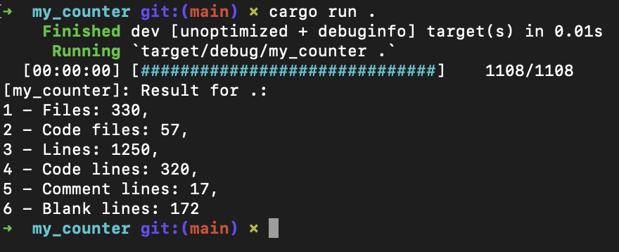

# my_counter
Folder lines, code lines, comment lines, file number, coding file number and empty line counter.

## Usage
#
    cargo run -h/--help to show help tab
    cargo run folder_name to show every informations about a specific folder

## Output
#

